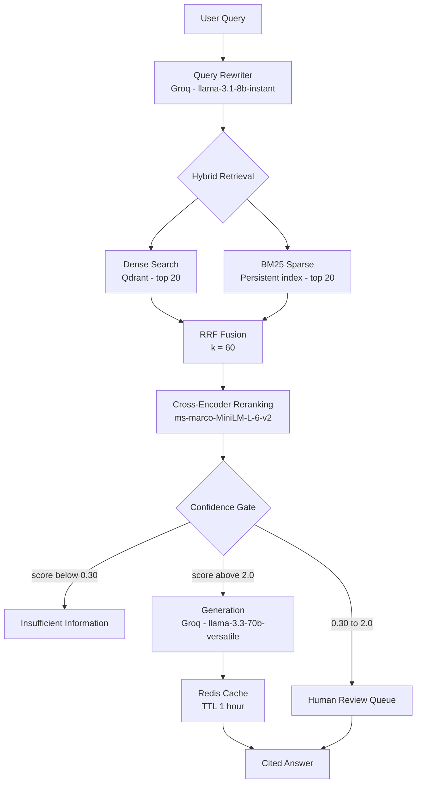
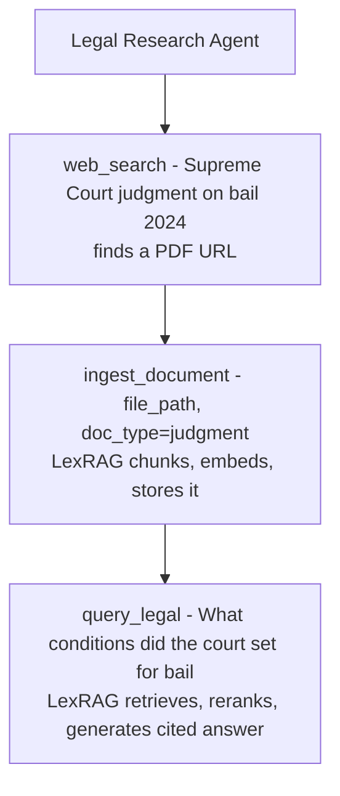
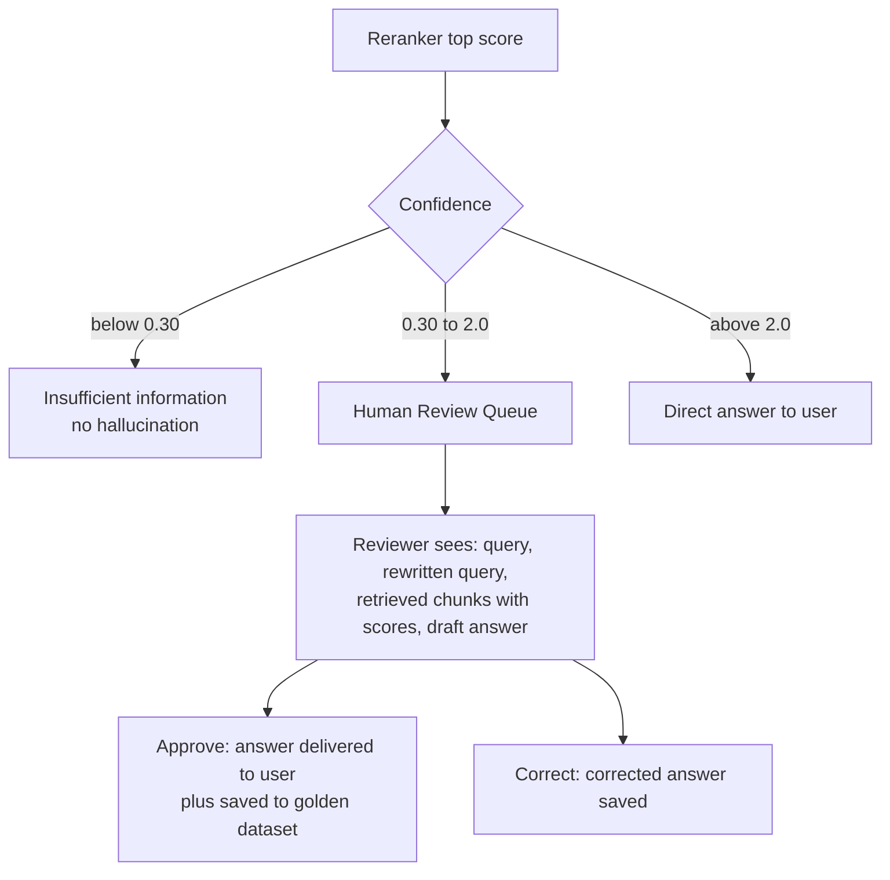
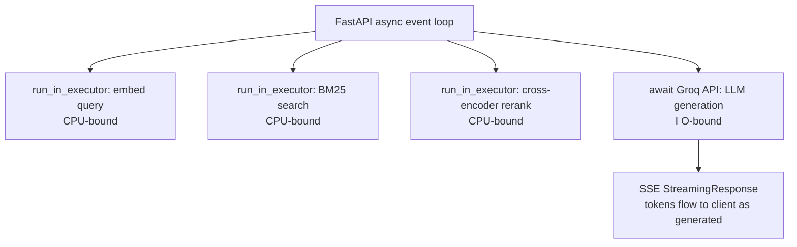

# ⚖️ LexRAG — Production-Grade Legal RAG System

A production-ready Retrieval-Augmented Generation system for Indian legal documents. LexRAG answers questions grounded strictly in ingested legal texts — IPC, Constitution, Supreme Court judgments, Contract Act — with source citations, confidence gating, human-in-the-loop review, and full production observability.

> **GitHub:** [github.com/kowshikkkkkk/lexrag](https://github.com/kowshikkkkkk/lexrag)

---

## 📋 Table of Contents

- [System Architecture](#system-architecture)
- [Key Design Decisions](#key-design-decisions)
- [Tech Stack](#tech-stack)
- [Project Structure](#project-structure)
- [Quick Start](#quick-start)
- [API Endpoints](#api-endpoints)
- [Performance](#performance)
- [Evaluation Results](#evaluation-results)
- [MCP Integration](#mcp-integration)
- [Human-in-the-Loop Pipeline](#human-in-the-loop-pipeline)
- [Async Architecture](#async-architecture)
- [Production Observability](#production-observability)
- [Evaluation Framework](#evaluation-framework)
- [Production Readiness](#production-readiness)
- [Running Tests](#running-tests)

---

## 🏗️ System Architecture



*Query rewriting expands abbreviations without hallucinating section numbers. Generation uses a 3000-token budget with citation enforcement and SSE streaming. Cache: ~1.8s on miss, under 5ms on hit.*

**Pipeline in one line:** query → rewrite → hybrid retrieve (dense + BM25) → fuse → rerank → confidence-gate → generate (or route to a human) → cache → cited answer.

---

## 🎯 Key Design Decisions

### 1. Hybrid Retrieval over Dense-Only
Dense vector search finds semantically similar chunks but fails on exact matches — if a user types "Section 420" verbatim, dense search might miss it. BM25 handles exact keyword matches perfectly. RRF fusion combines both ranked lists — a chunk ranking high in both gets a significantly higher combined score. This is the single biggest retrieval quality improvement over a naive RAG system.

### 2. Persistent BM25 Index
Naive implementations rebuild BM25 from scratch on every query by fetching all chunks from the vector store — O(n) per query. LexRAG serializes the BM25 index to disk after every ingest and loads it once on startup. At 1000+ chunks the difference is seconds vs milliseconds per query.

### 3. Section-Aware Chunking for Legal Documents
Legal Acts have explicit structure: Parts → Chapters → Sections. Naive character-based chunking splits "Section 420 defines cheating as..." mid-sentence across two chunks. Our chunker detects section headers via regex across multiple formats (`Section 420`, `420. Title —`, `Article 21`) and splits at section boundaries. Each chunk carries `section_number` metadata for precise citation.

We chose recursive splitting over semantic chunking because legal documents have explicit structure more reliable than cosine similarity drops, and semantic chunking requires embedding every sentence before chunking — expensive without proven benefit.

### 4. Cross-Encoder Reranking as Second Stage
Bi-encoder embeddings encode query and document independently. Cross-encoders process the query-document pair together, giving much more accurate relevance scores. Running cross-encoder on the full corpus is too slow — we run it only on the top-20 fused results. The score gap between relevant and irrelevant chunks is dramatic (9.5 vs 1.3 in testing).

### 5. Confidence Gating prevents Hallucination
Legal is a high-stakes domain. Instead of generating an answer when retrieval quality is low:
- Below `MIN_SIMILARITY_THRESHOLD (0.30)` → fixed "insufficient information" string
- Below `REVIEW_THRESHOLD (2.0)` → human review queue with draft answer

The system never confidently answers when it doesn't have reliable grounding.

### 6. Query Rewriting without Section Hallucination
Early testing showed the LLM rewriter adding section numbers from its training knowledge ("Section 415 for cheating") when the document only had Section 420. This caused retrieval misses. Explicit prompt instructions fixed this: never add section numbers unless the user mentioned one. Faithfulness score improved from 0.667 to 0.889 after this fix.

### 7. Human Review Queue builds Golden Dataset Organically
Instead of manually writing QA pairs for evaluation, every approved review item is saved as a golden dataset entry — question, rewritten query, answer, retrieved contexts, sources. Real user queries with human-verified answers are better ground truth than synthetic data.

### 8. Async Thread Pool for CPU-Bound Operations
CPU-bound operations (embedding, cross-encoder reranking) running synchronously block FastAPI's async event loop under concurrent load. Moving them to a `ThreadPoolExecutor` reduced median query latency from 7.3s to 3.1s under 10 concurrent users — a 57% improvement.

### 9. Singleton Pattern for Heavy Models
The embedding model (~400MB) and reranker are loaded once on startup. Every import across the codebase gets the same already-loaded instance. No repeated file reads, no per-request model loading.

### 10. Structured JSON Logging with Trace IDs
Every log line is a JSON object with timestamp, level, module, and a trace ID set per request in FastAPI middleware. The same trace ID appears across every layer — ingestion, retrieval, reranking, generation — for a single request.

---

## 🛠️ Tech Stack

| Component | Tool | Why |
|---|---|---|
| LLM | Groq (llama-3.3-70b) | Fastest inference, free tier |
| Embeddings | BAAI/bge-base-en-v1.5 | Top MTEB score, 768 dims, free |
| Vector DB | Qdrant | Production-grade, Docker-native |
| Sparse Search | BM25 (rank-bm25) | Exact keyword matching, persistent index |
| Reranker | ms-marco-MiniLM-L-6-v2 | Fast cross-encoder, strong performance |
| Cache | Redis | <5ms cache hits, 93% latency reduction |
| API | FastAPI + Pydantic | Async, type-safe, auto docs |
| Streaming | SSE (Server-Sent Events) | Real-time token streaming |
| Tracking | MLflow | Experiment comparison across configs |
| Evaluation | Custom LLM-judge harness | RAGAS-compatible metrics |
| Dashboard | Streamlit | Rapid UI, Python-native |
| Monitoring | Prometheus + Grafana | Real-time metrics and dashboards |
| Load Testing | Locust | Concurrent user simulation |
| CI/CD | GitHub Actions | Automated testing on every push |
| Containers | Docker + docker-compose | Reproducible deployment |
| Protocol | MCP (Model Context Protocol) | Agent-accessible tools |

---

## 📁 Project Structure

```
lexrag/
├── config/
│   ├── settings.py          # Pydantic settings — single source of truth
│   ├── constants.py         # No magic numbers — system prompt, RRF_K etc
│   └── exceptions.py        # Typed exception hierarchy per layer
├── ingestion/
│   ├── loader.py            # PDF/TXT/DOCX loading, normalization, file hash
│   └── pipeline.py          # Full ingest pipeline: load→chunk→embed→store→BM25
├── chunking/
│   └── splitter.py          # Recursive + section-aware chunking
├── embeddings/
│   └── embedder.py          # Singleton BGE embedder with batching + retry
├── vectorstore/
│   └── store.py             # Qdrant wrapper — upsert, search, dedup
├── retrieval/
│   ├── retriever.py         # Hybrid retrieval: dense + BM25 + RRF fusion
│   ├── reranker.py          # Cross-encoder reranking
│   └── bm25_index.py        # Persistent BM25 index — load once, rebuild on ingest
├── generation/
│   ├── query_rewriter.py    # LLM-based query rewriting
│   └── generator.py         # Generation with token budget + SSE streaming
├── api/
│   ├── app.py               # FastAPI factory, middleware, exception handlers
│   ├── schemas.py           # Pydantic request/response schemas
│   ├── mcp_server.py        # MCP server exposing RAG tools to agents
│   └── routes/
│       ├── ingest.py        # POST /ingest
│       ├── query.py         # POST /query, GET /query/stream
│       └── review.py        # GET /review/pending, POST /review/decide
├── evaluation/
│   └── ragas_eval.py        # LLM-judge evaluation: faithfulness, relevancy etc
├── observability/
│   ├── logger.py            # JSON structured logging with trace IDs
│   ├── mlflow_tracker.py    # MLflow experiment tracking
│   ├── cache.py             # Redis query cache
│   └── metrics.py           # Prometheus metrics
├── static/
│   └── dashboard.py         # Streamlit dashboard
├── scripts/
│   └── locustfile.py        # Load testing
├── tests/
│   └── unit/
│       ├── test_loader.py
│       └── test_chunker.py
├── docker/
│   ├── Dockerfile
│   ├── docker-compose.yml
│   └── prometheus.yml
└── .github/
    └── workflows/
        └── ci.yml
```

---

## 🚀 Quick Start

### Prerequisites
- Python 3.11+
- Docker Desktop
- Groq API key (free at [console.groq.com](https://console.groq.com))

### 1. Clone and setup

```bash
git clone https://github.com/kowshikkkkkk/lexrag.git
cd lexrag
python -m venv venv
source venv/Scripts/activate  # Windows Git Bash
pip install -r requirements.txt
cp .env.example .env
# Add your GROQ_API_KEY to .env
```

### 2. Start services

```bash
cd docker
docker-compose up qdrant redis -d
cd ..
```

### 3. Start the API

```bash
uvicorn main:app --host 0.0.0.0 --port 8000 --reload
```

### 4. Start the Dashboard

```bash
streamlit run static/dashboard.py
```

Open `http://localhost:8501`

### 5. API Documentation

Open `http://localhost:8000/api/v1/docs`

### 6. Start monitoring stack

```bash
cd docker
docker-compose up prometheus grafana -d
```

- Prometheus: `http://localhost:9090`
- Grafana: `http://localhost:3000` (admin / lexrag123)

### 7. Run load tests

```bash
locust -f scripts/locustfile.py --host http://localhost:8000
```

Open `http://localhost:8089`

---

## 📡 API Endpoints

| Method | Endpoint | Description |
|---|---|---|
| POST | `/api/v1/ingest` | Upload and index a legal document |
| POST | `/api/v1/query` | Ask a question, get cited answer |
| GET | `/api/v1/query/stream` | Same as query but SSE streaming |
| GET | `/api/v1/review/pending` | Get pending human review items |
| POST | `/api/v1/review/decide` | Approve or correct a review item |
| GET | `/api/v1/review/approved` | Get golden dataset |
| GET | `/api/v1/health` | Service health check |
| GET | `/api/v1/metrics` | Prometheus metrics |

---

## ⚡ Performance

### Load Test Results (10 concurrent users)

| Metric | Sync pipeline | Async pipeline |
|---|---|---|
| Query median latency | 7300ms | **3100ms** |
| Cached query median | 10000ms | **730ms** |
| Failure rate | 0% | **0%** |
| RPS | 1.0 | 0.6 |

Async improvement achieved by running CPU-bound operations (embedding, reranking) in a `ThreadPoolExecutor` so they don't block FastAPI's async event loop.

### Redis Cache Impact

| Request type | Latency |
|---|---|
| Cache miss (full pipeline) | ~1.8s |
| Cache hit (Redis) | <5ms |
| Latency reduction | **93%** |

Cache TTL: 1 hour. Auto-invalidates on new document ingestion.

### Component Latencies (single request)

| Component | Typical latency |
|---|---|
| Query rewriting | 200-500ms |
| Dense retrieval (Qdrant) | 80-150ms |
| BM25 sparse search | 10-30ms |
| RRF fusion | <5ms |
| Cross-encoder reranking | 60-280ms |
| LLM generation (Groq) | 400-800ms |
| **Total (cache miss)** | **~1.5-2s** |
| **Total (cache hit)** | **<5ms** |

---

## 📊 Evaluation Results

Evaluated on 3 golden QA pairs from the Indian Penal Code using a custom LLM-judge harness:

| Metric | Before query rewriter fix | After fix |
|---|---|---|
| Faithfulness | 0.667 | **0.889** |
| Answer Relevancy | 0.654 | **0.731** |
| Context Precision | 0.667 | 0.667 |
| Context Recall | 0.667 | 0.667 |

The eval loop caught the query rewriter hallucinating section numbers → fix applied → faithfulness jumped 33%. This is the eval-driven development loop in practice.

---

## 🤖 MCP Integration — Agent-Accessible Legal Research

LexRAG implements the **Model Context Protocol (MCP)**, making the entire RAG pipeline accessible as tools to any MCP-compatible AI agent — Claude, custom LangGraph agents, or any other MCP client.

### Why MCP matters here

Without MCP, LexRAG is a standalone API. With MCP, it becomes a tool that an AI agent can autonomously call as part of a larger workflow:



The agent found new legal content, ingested it, and queried it — all via MCP tool calls with zero human intervention.

### Three tools exposed

**`query_legal`** — Runs the full pipeline: query rewrite → hybrid retrieval → reranking → generation. Returns cited answer with sources.

**`ingest_document`** — Runs the full ingestion pipeline: load → chunk → embed → store. Returns chunk count and file hash.

**`list_ingested_documents`** — Lists all documents in the knowledge base. Lets an agent check before re-ingesting.

### Add to Claude Desktop

```json
{
  "mcpServers": {
    "lexrag": {
      "command": "python",
      "args": ["E:/lexrag/api/mcp_server.py"],
      "env": {
        "PYTHONPATH": "E:/lexrag"
      }
    }
  }
}
```

---

## 🔄 Human-in-the-Loop Pipeline

LexRAG implements a three-tier response system based on retrieval confidence:



Every approved answer automatically becomes a golden dataset entry. Ground truth grows from real usage — no manual QA writing needed.

---

## ⚡ Async Architecture

CPU-bound operations run in a `ThreadPoolExecutor` to avoid blocking the async event loop:



---

## 📈 Production Observability

### Structured JSON Logging

```json
{
  "ts": "2026-06-14T07:19:24.511074+00:00",
  "level": "INFO",
  "logger": "retrieval.retriever",
  "trace_id": "dbc11055",
  "msg": "Retrieval complete",
  "results": 3,
  "top_score": 0.032522,
  "latency_ms": 86.58
}
```

The same `trace_id` appears across every layer for a single request. Filter by trace ID to see the complete lifecycle.

### Prometheus Metrics

| Metric | Type | Description |
|---|---|---|
| `lexrag_queries_total` | Counter | Total queries by status |
| `lexrag_query_latency_seconds` | Histogram | End-to-end latency |
| `lexrag_retrieval_latency_seconds` | Histogram | Retrieval latency |
| `lexrag_rerank_latency_seconds` | Histogram | Reranking latency |
| `lexrag_generation_latency_seconds` | Histogram | LLM generation latency |
| `lexrag_cache_hits_total` | Counter | Redis cache hits |
| `lexrag_cache_misses_total` | Counter | Redis cache misses |
| `lexrag_chunks_total` | Gauge | Chunks in vector store |
| `lexrag_errors_total` | Counter | Errors by type |

### MLflow Experiment Tracking

```bash
mlflow ui --backend-store-uri sqlite:///data/mlflow/mlflow.db --port 5000
```

Every query run logs: chunk_size, embedding_model, rerank_model, dense_top_k, llm_model, all latencies, top_rerank_score, went_to_review.

---

## 🧠 Evaluation Framework

LexRAG uses a custom LLM-judge harness implementing four RAGAS-compatible metrics:

| Metric | How measured |
|---|---|
| **Faithfulness** | Each answer sentence judged by Groq against retrieved context |
| **Answer Relevancy** | Cosine similarity between question and answer embeddings |
| **Context Precision** | Fraction of retrieved chunks judged relevant to the question |
| **Context Recall** | Whether retrieved context contains enough to produce the ground truth |

```bash
python evaluation/ragas_eval.py
```

Results are automatically logged to MLflow.

---

## 🏆 Production Readiness

| Component | Status |
|---|---|
| Hybrid retrieval (dense + BM25 + RRF) | ✅ |
| Cross-encoder reranking | ✅ |
| Persistent BM25 index | ✅ |
| Confidence gating | ✅ |
| Human review loop | ✅ |
| Redis query cache | ✅ |
| Async thread pool pipeline | ✅ |
| Prometheus monitoring | ✅ |
| Grafana dashboards | ✅ |
| Docker + docker-compose | ✅ |
| GitHub Actions CI | ✅ |
| MCP integration | ✅ |
| Load tested (10 users, 0% failure) | ✅ |
| Section-aware legal chunking | ✅ |
| SSE streaming | ✅ |
| Authentication (JWT) | ⬜ next milestone |
| Cloud deployment (Azure ACI) | ⬜ next milestone |

---

## 🧪 Running Tests

```bash
pytest tests/unit/ -v
```
